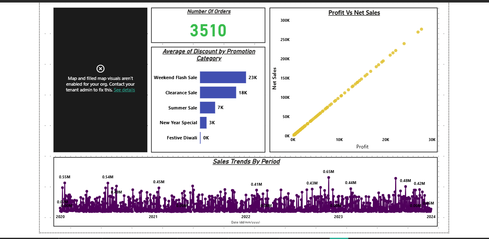
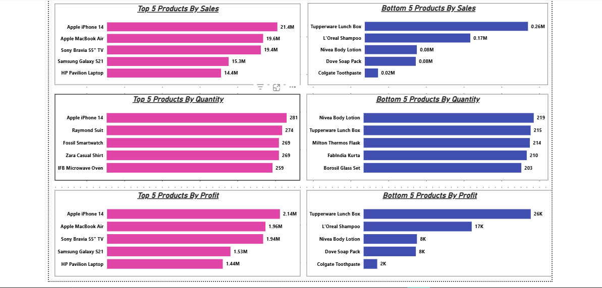
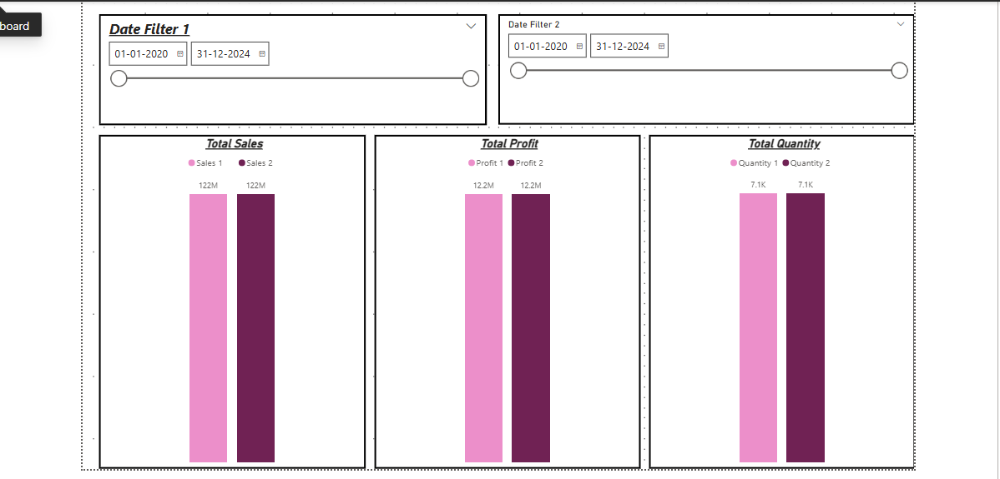
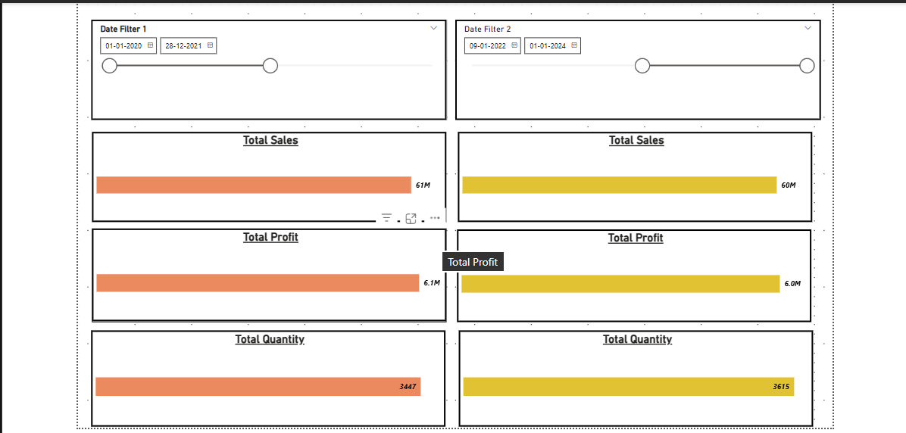
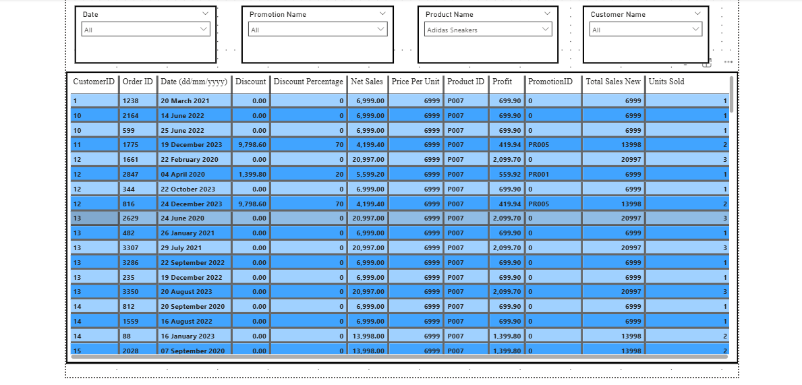

# Sales Data Analysis Dashboard
**Tool:** Power BI | **Domain:** Retail & E-Commerce | **Records Analysed:** 3,510+ Orders | **Period:** 2020–2024

---

## Problem Statement

This dashboard helps retail businesses monitor and analyse their sales performance across products, promotions, and time periods. It enables business managers to identify top and bottom performing products, understand the impact of promotions on revenue, compare performance across two custom date ranges, and track sales trends over time — all from a single interactive report.

Since Weekend Flash Sale drives the highest average discount (23K) compared to Festive Diwali (0K), the business can re-evaluate its promotional strategy to improve discount ROI across all categories.

---

## Dashboard Pages Overview

### Page 1 — Sales Overview
- Total number of orders: **3,510**
- Sales trends by period (2020–2024) using a needle/lollipop chart
- Profit vs Net Sales scatter plot showing strong positive correlation
- Average discount breakdown by promotion category:
  - Weekend Flash Sale: 23K
  - Clearance Sale: 18K
  - Summer Sale: 7K
  - New Year Special: 3K
  - Festive Diwali: 0K

### Page 2 — Product Performance
- **Top 5 Products by Sales:** Apple iPhone 14 (21.4M), Apple MacBook Air (19.6M), Sony Bravia 55" TV (19.4M), Samsung Galaxy S21 (15.3M), HP Pavilion Laptop (14.4M)
- **Bottom 5 Products by Sales:** Colgate Toothpaste (0.02M), Dove Soap Pack (0.08M), Nivea Body Lotion (0.08M), L'Oreal Shampoo (0.17M), Tupperware Lunch Box (0.26M)
- **Top 5 Products by Quantity:** Apple iPhone 14 (281), Raymond Suit (274), Fossil Smartwatch (269), Zara Casual Shirt (269), IFB Microwave Oven (259)
- **Top 5 Products by Profit:** Apple iPhone 14 (2.14M), Apple MacBook Air (1.96M), Sony Bravia 55" TV (1.94M)

### Page 3 — Period Comparison (Side by Side)
- Dual date range slicers to compare any two custom time periods
- Side-by-side KPI comparison for Total Sales, Total Profit, and Total Quantity
- Example comparison: Jan 2020–Dec 2021 (Sales: 61M, Profit: 6.1M, Qty: 3,447) vs Jan 2022–Jan 2024 (Sales: 60M, Profit: 6.0M, Qty: 3,615)

### Page 4 — Granular Data Table
- Filterable detailed table by Date, Promotion Name, Product Name, Customer Name
- Columns: CustomerID, OrderID, Date, Discount, Discount %, Net Sales, Price Per Unit, ProductID, Profit, PromotionID, Total Sales, Units Sold

---

## Business Questions Answered
- Which products are driving the most revenue and profit?
- Which products are underperforming and need attention?
- How do two different time periods compare in sales performance?
- Which promotions generate the highest discounts?
- How have sales trended month over month from 2020 to 2024?
- What is the relationship between profit and net sales?

---

## Key Insights
- **Apple iPhone 14** is the top performer across all three metrics — Sales (21.4M), Quantity (281 units), and Profit (2.14M)
- **Colgate Toothpaste** has the lowest sales at just 0.02M — a potential candidate for discontinuation or repricing
- **Weekend Flash Sale** drives the highest average discount at 23K — nearly 5x more than Summer Sale (7K)
- **Profit and Net Sales** show a strong positive linear correlation — higher sales consistently translate to higher profits
- Sales peak visible around mid-2023 (0.65M) — suggesting a seasonal or campaign-driven spike worth investigating

---

## Data Model & Technical Implementation

### Data Modelling
- Implemented **Star Schema** with fact and dimension tables
- Defined **Primary & Foreign Key** relationships
- Set correct **Cardinality** for all table relationships (One-to-Many)

### DAX Measures Created
```
Total Sales = SUM(Sales[Net Sales])
Total Profit = SUM(Sales[Profit])
Total Quantity = SUM(Sales[Units Sold])
Sales 1 = CALCULATE([Total Sales], DateFilter1)
Sales 2 = CALCULATE([Total Sales], DateFilter2)
Profit 1 = CALCULATE([Total Profit], DateFilter1)
Profit 2 = CALCULATE([Total Profit], DateFilter2)
Quantity 1 = CALCULATE([Total Quantity], DateFilter1)
Quantity 2 = CALCULATE([Total Quantity], DateFilter2)
```

### Power Query Transformations
- Data profiling using column distribution, column quality, and column profile
- Data type corrections and column cleaning
- Null value handling in discount and sales columns

### Filters & Interactions
- Configured **Edit Interactions** to control cross-filtering behaviour between visuals
- Dimension table slicers with modified filter behaviour
- Four slicers: Date, Promotion Name, Product Name, Customer Name

---

## Screenshots

### Page 1 — Sales Overview


### Page 2 — Product Performance


### Page 3 — Period Comparison


### Page 4 — Period Comparison (Custom Range)


### Page 5 — Granular Data Table


---

## How to Open
1. Download **Power BI Desktop** for free from [microsoft.com](https://powerbi.microsoft.com/desktop)
2. Clone or download this repository
3. Open `sales_analysis.pbix` in Power BI Desktop
4. Use the slicers on each page to interact with the report

---

## Tools & Concepts Used
| Area | Details |
|------|---------|
| Tool | Power BI Desktop |
| Data Modelling | Star Schema, Primary/Foreign Keys, Cardinality |
| DAX | CALCULATE, SUM, date-based measures for period comparison |
| Power Query | Data profiling, transformations, null handling |
| Visualisations | Lollipop/needle chart, scatter plot, bar charts, data table, slicers |
| Filters | Edit Interactions, dimension slicer filter behaviour |
